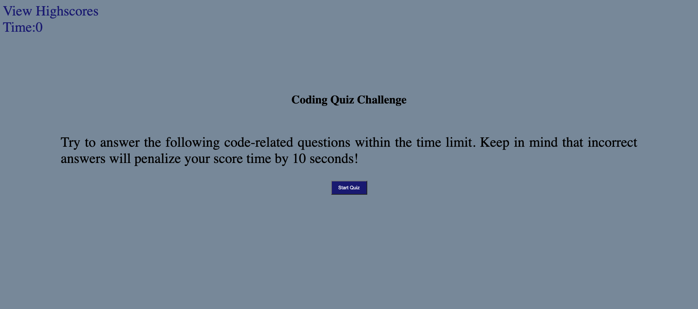

# HOMEWORK4_CODE_QUIZ
# Description
This project was to create a quiz witha minimum of 5 questions. 

1. click start
    - timer start (countdown from 60 sec)
    - first question appears
2. user answer question
    - if user answer correct:
        - move to the next question
        - increase score count by 1
    - if user answeres incorrect:
        - move to next question
        - minus 10 sec from timer
3. end of quiz
    - user answers all questions
    - timer hits 0
4. scoreboard
    - enter initals
    - local storage (key: intitals / value: score)
# Link
https://christa-baccas.github.io/HOMEWORK4_CODE_QUIZ/

# ScreenShot

# Help / Assistance
- Study Group
- TA After Hours
- Tutor Sessions
